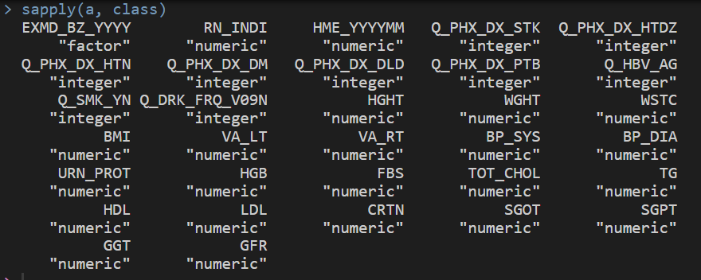
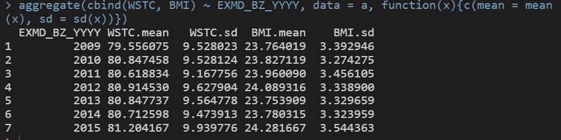
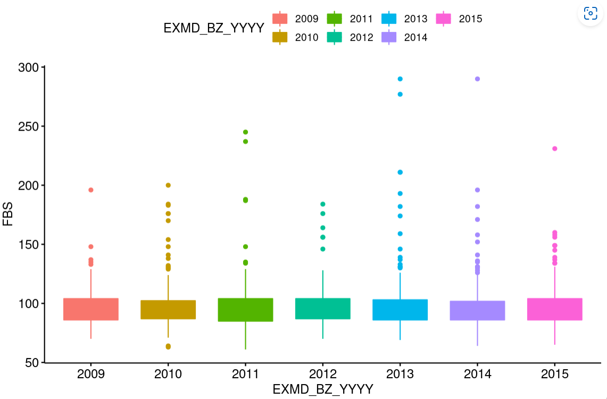

#                              **2022년 10월 18일 중간고사**

## Q1. “Q_” 로 시작하는 변수는 범주형(factor)으로, 나머지 변수는 숫자형(integer)으로 만드세요.   

```
library(data.table);library(magrittr);library(ggpubr);library(rvg);library(officer) 
a <- fread("https://raw.githubusercontent.com/jinseob2kim/R-skku-biohrs/main/data/example_g1e.csv")

var.factor <- grep("Q_", names(a), value = T)  
var.conti <- names(a)[!(names(a) %in% var.factor)] 

a[, (var.factor) := lapply(.SD, as.factor), .SD = var.factor]
a[, (var.conti) := lapply(.SD, as.numeric), .SD = var.conti]
sapply(a, class)
```


## Q2. 연속 변수 “WSTC”와 “BMI”의 연도별 평균 및 표준편차를 구하세요.

```
both <- aggregate(cbind(WSTC, BMI) ~ EXMD_BZ_YYYY, data = a, function(x){c(mean = mean(x), sd = sd(x))})
aggregate(cbind(WSTC, BMI) ~ EXMD_BZ_YYYY, data = a, function(x){c(mean = mean(x), sd = sd(x))})
```


## Q3. 연도별 “FBS”를 나타내는 Boxplot을 그린 후 pptx로 저장하세요. (x축: “EXMD_BZ_YYYY”, y축: “FBS”)

```
a$EXMD_BZ_YYYY <- factor(a$EXMD_BZ_YYYY)
p <- ggboxplot(a, "EXMD_BZ_YYYY", "FBS", fill = "EXMD_BZ_YYYY", color = "EXMD_BZ_YYYY")

plot_vec <- rvg::dml(ggobj = p)

plot_file <- read_pptx() %>%
  add_slide() %>% ph_with(dml(ggobj = p), location = ph_location_type(type="body"))
print(plot_file, target = "plot_file.pptx")
```

